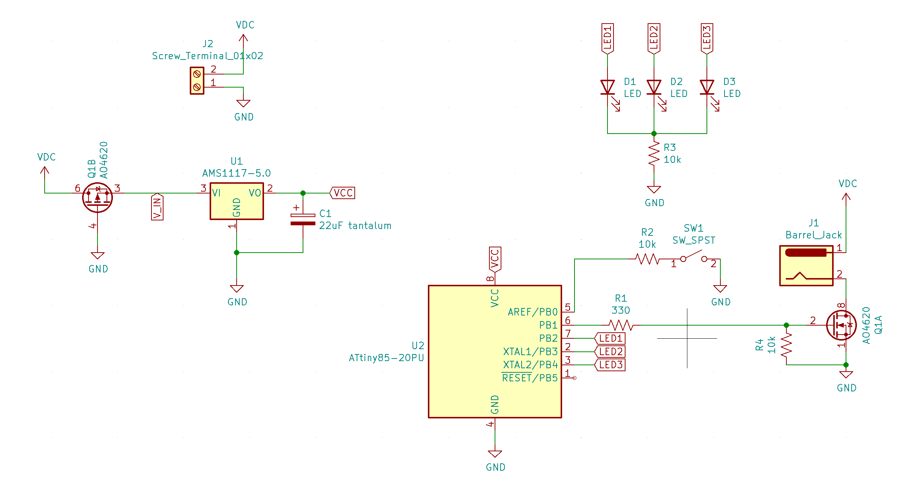
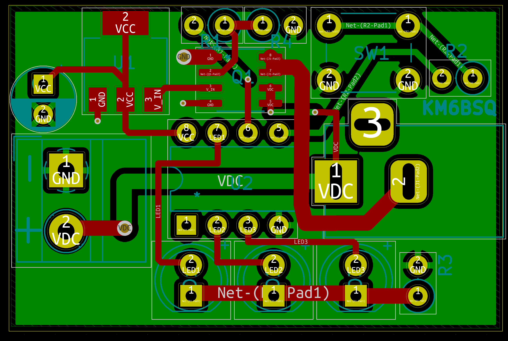
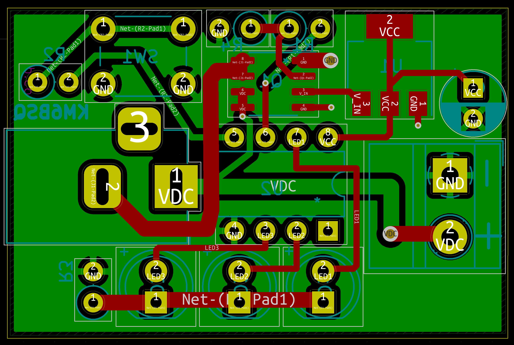

# 24h timer switch

 

# Fabrication

See kicad files.

## BOM
| Id | Designator | Package | Designation | Value | 
| ------------- | ------------- | ------------- | ------------- |------------- |

## PCB

 
 
 

<a href="https://oshpark.com/shared_projects/55EIuuMn"></img></a>